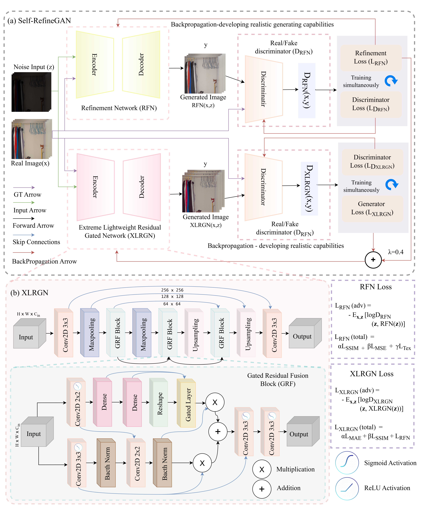
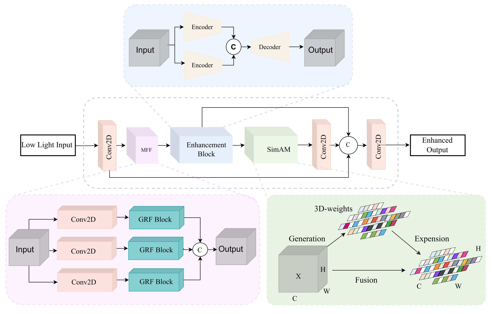

# Enhancing Low-Light Image Quality with SelfRefineGAN: A Lightweight GAN Approach

Official **TensorFlow/Keras implementation** of **SelfRefineGAN**, a lightweight Generative Adversarial Network designed for high-fidelity low-light image enhancement on resource-constrained edge devices.

## 🚀 Overview

SelfRefineGAN addresses the trade-off between enhancement quality and computational efficiency. The framework introduces a training paradigm in which a **Refinement Network (RFN)** guides an **Extreme Lightweight Residual Gated Network (XLRGN)**.

- **Training Phase:** XLRGN and RFN are trained iteratively using adversarial, structural-similarity, pixel-wise, and texture-aware objectives.
- **Inference Phase:** The RFN and discriminator are removed, leaving only the ultra-lightweight XLRGN with **0.025M parameters** for efficient real-time deployment.

## ✨ Key Contributions

- **XLRGN Generator:** An extreme lightweight residual gated network optimized for high-quality low-light image enhancement on edge devices.
- **Refinement Network (RFN):** A curriculum-style refinement network that guides XLRGN during training and is decoupled during inference.
- **Gated Residual Fusion (GRF):** A dynamic gated mechanism that adaptively balances residual features and identity information.
- **Composite Loss:** A training objective combining pixel-wise, structural-similarity, perceptual, adversarial, and texture-energy constraints.
- **Efficiency:** SelfRefineGAN achieves high-quality enhancement using only **0.025M parameters**, and **3.691 GFLOPs**.

## 🖼️ Architecture

### SelfRefineGAN Pipeline and XLRGN Architecture

<p align="center">
  
</p>

**Figure 1.** **(a) SelfRefineGAN pipeline:** A dual-stream framework that processes low-light and reference image pairs $(z, x)$. XLRGN is optimized using the generator loss $L_{XLRGN}$ and discriminator $D_{XLRGN}$, while RFN produces a refined image supervised by $L_{RFN}$ and $D_{RFN}$. Joint optimization uses weighted backpropagation with $\lambda = 0.4$ to maintain consistent learning between the refinement and lightweight generation streams. **(b) XLRGN architecture:** A symmetric encoder-decoder with skip connections and Gated Residual Fusion blocks. Each GRF block uses a gating branch with dense layers and sigmoid activation to generate attention weights, together with a parallel convolutional branch for feature extraction.

### Proposed RFN Model Architecture

<p align="center">
  
</p>

**Figure 2.** The proposed **Refinement Network (RFN)** architecture. The network combines multi-feature fusion, an enhancement block, residual learning, SimAM attention, and feature concatenation to generate a refined enhanced output during training.

## 📊 Datasets

The following datasets were used for training and evaluating SelfRefineGAN:

- [LOLv1 Dataset](https://daooshee.github.io/BMVC2018website/): 500 paired low-light and normal-light images.
- [LOLv2 Dataset](https://github.com/flyywh/CVPR-2020-Semi-Low-Light): LOLv2-Real and LOLv2-Synthetic subsets.
- [MIT-Adobe FiveK](https://data.csail.mit.edu/graphics/fivek/): 5,000 professionally retouched photographs.
- [SICE Dataset](https://github.com/csjcai/SICE): Multi-exposure image sequences.

## 📚 Citation

If you use this code or SelfRefineGAN in your research, please cite:

```bibtex
@article{Atif2026SelfRefineGAN,
  author  = {Atif, Muhammad and Zhang, Yudong and Mamoon, Saqib},
  title   = {Enhancing low-light image quality with {SelfRefineGAN}: a lightweight {GAN} approach},
  journal = {Signal, Image and Video Processing},
  volume  = {20},
  pages   = {495},
  year    = {2026},
  doi     = {10.1007/s11760-026-05477-1},
  url     = {https://doi.org/10.1007/s11760-026-05477-1}
}
```

**Paper:** [Enhancing low-light image quality with SelfRefineGAN: a lightweight GAN approach](https://doi.org/10.1007/s11760-026-05477-1)
